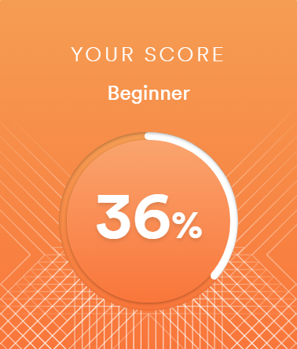

# Alexey Leshchev
## Contact information
**Phone:** +1 574-675-19-93

**email:** bernout.tuc@yandex.ru

**GitHub:** [TucBernout](https://github.com/TucBernout)

**Telegram:** [Alexey Ersan](https://t.me/BernoutTuc)

**Discord:** TucBernout#1289
___

## About me

Hello. My name is Alexey. My goal is to get basic programming skills. My single-mindedness will help me in this. There is no experience in real projects. I am motivated to learn. My motivation is based on the desire to gain new knowledge. The desire to master languages such as: JS Python C++
___
## My skills
* HTML5
* CSS3
* Git
___
## Code example
```
function multiply(a, b) {
  return a * b
} ​
let result = sum(1, 2);
alert( result );
```
___
## Experience
[Page about me](https://tucbernout.github.io/rsschool-cv/cv)
___
## Education
* **University:** Legal education (Unfinished higher education)
* **Course:**
    * [HTML5](https://ru.code-basics.com/languages/html)
    * [CSS](https://ru.code-basics.com/languages/css)
___
## Languages
**English:** Elementary (I am working on improving my English proficiency)

